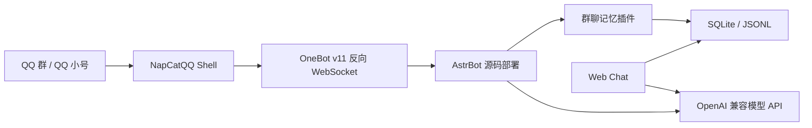

# QQ 群智能客服快速部署方案

这是一个面向服务器部署的 QQ 群智能客服开源方案。它基于 NapCatQQ + AstrBot + OpenAI 兼容模型 API，提供群聊机器人、群聊记忆、长期 FAQ 沉淀、网页测试入口和日常运维手册。

安装脚本支持 Ubuntu、Debian、CentOS、RHEL、Alibaba Cloud Linux 等常见服务器系统，会自动识别 `apt-get`、`dnf` 或 `yum`，并通过 `uv` 自动准备 AstrBot 所需的新版 Python。Python 依赖默认优先安装预编译 wheel，避免 CentOS 7 老编译器编译失败；镜像会从阿里云切到官方 PyPI。

本项目不推荐 Docker 部署 NapCat。实践里 Docker 版 NapCat 的 QQ 登录状态更容易失效，重启或容器异常后经常需要重新扫码；本项目默认采用 Linux 原生部署和 systemd 托管。

## 能做什么

- QQ 群成员 @机器人 后，机器人按客服边界回答产品、账号、额度、模型、工具配置、售后流程和报错排障问题。
- 群聊消息写入 SQLite，作为后续检索、群聊总结和 FAQ 沉淀的依据。
- 每日从群聊里抽取可长期复用的 FAQ，过滤闲聊、玩笑和无结论讨论。
- 支持“近一天”“昨天”“本周”“近一个月”等时间范围总结。
- 提供独立 Web Chat，用同一份记忆库测试客服效果，不向 QQ 群发消息。
- 支持图片输入排障；如需长期入库，可扩展 OCR 或视觉摘要。

## 推荐架构



## 中文文档

本项目默认面向中文 QQ 用户，核心文档都在 [docs/](docs/README.md)：

- [中文快速开始](docs/00-quickstart.md)
- [原生部署指南](docs/01-native-deploy.md)
- [群聊记忆系统](docs/02-memory-system.md)
- [运维和排障手册](docs/03-runbook.md)
- [客服提示词和知识库策略](docs/04-prompts.md)
- [安全边界](docs/05-security.md)
- [NapCat 连接 AstrBot](docs/06-napcat-onebot.md)

## 一行命令部署

国内服务器建议使用 Gitee 地址：

```bash
curl -fsSL https://gitee.com/xiashaoyan/qq-ai-customer-service/raw/main/install.sh | sudo bash -s -- --repo https://gitee.com/xiashaoyan/qq-ai-customer-service.git
```

如果服务器访问 GitHub 稳定，也可以使用 GitHub：

```bash
curl -fsSL https://raw.githubusercontent.com/ShaoyanXia/qq-ai-customer-service/main/install.sh | sudo bash -s -- --repo https://github.com/ShaoyanXia/qq-ai-customer-service.git
```

安装脚本会完成：

- 安装系统依赖。
- 创建 `qqbot` 服务用户。
- 拉取本项目到 `/opt/chat-qqrobot`。
- 源码安装 AstrBot 到 `/opt/AstrBot`，国内默认使用 Gitee 镜像，GitHub 作为备用。
- 安装群聊记忆插件。
- 安装 Web Chat 到 `/opt/xigua-web-chat`。
- 写入 `/etc/qqbot/*.env`。
- 安装并启动 systemd 服务。
- 启动 NapCat Shell 原生安装流程。
- 如果检测到 `/root/Napcat/opt/QQ/qq`，自动创建 `napcat.service`，避免前台窗口关闭后 NapCat 退出。

NapCat 的 QQ 登录和 OneBot 配置仍需要用户按提示完成扫码和连接，这是 QQ 登录机制决定的，不能完全无人值守。

## 手动快速开始

1. 阅读 [原生部署指南](docs/01-native-deploy.md)，在服务器安装 NapCatQQ Shell、AstrBot 和 systemd 服务。
2. 按 [记忆系统说明](docs/02-memory-system.md) 安装 `plugins/astrbot_plugin_group_memory`。
3. 将 [客服提示词](docs/04-prompts.md) 写入 AstrBot persona，并配置 OpenAI 兼容 provider。
4. 用 [运维手册](docs/03-runbook.md) 检查 QQ 在线、OneBot 连接、消息入库和 Web Chat。
5. 按 [安全边界](docs/05-security.md) 收紧端口、token 和日志，避免凭据进入知识库。

## 仓库结构

```text
configs/
  astrbot.env.example
  astrbot-provider.example.json
  web-chat.env.example
  systemd/
docs/
install.sh
plugins/
  astrbot_plugin_group_memory/
scripts/
web-chat/
```

## 最小验收清单

- QQ 小号在线，NapCat WebUI 可通过 SSH 隧道访问。
- `systemctl status napcat.service` 正常。
- AstrBot WebUI 可本机访问，OneBot v11 显示已连接。
- 群内 @机器人 能回复，且不跑出客服边界。
- `/chatmem_status` 能看到消息数增长。
- SQLite 中 `messages` 表有新群聊消息。
- 问“总结近一天群聊消息”时，回答包含时间范围、命中条数和知识库总条数。
- Web Chat `/health` 正常，并能读取同一份 SQLite。

## 重要提醒

- 使用 QQ 小号，不要使用主号。
- 不要把 NapCat WebUI、AstrBot Dashboard、OneBot HTTP 暴露到公网。
- Web Chat 如需公网访问，必须加 token 或反向代理鉴权。
- 不要把 API key、QQ 登录二维码、root 密码、后台凭据写入 Markdown、Git、截图或群消息。
- 改插件或 provider 配置时优先只重启 AstrBot；不到必须，不重启 NapCat。

## 参考资料

- NapCatQQ 官方安装文档：https://napneko.github.io/guide/install
- NapCatQQ Shell 文档：https://napneko.github.io/guide/boot/Shell
- AstrBot 官方文档：https://docs.astrbot.app/
- AstrBot 源码部署：https://docs.astrbot.app/en/deploy/astrbot/cli.html
- AstrBot OneBot v11 接入：https://docs.astrbot.app/en/platform/aiocqhttp.html
